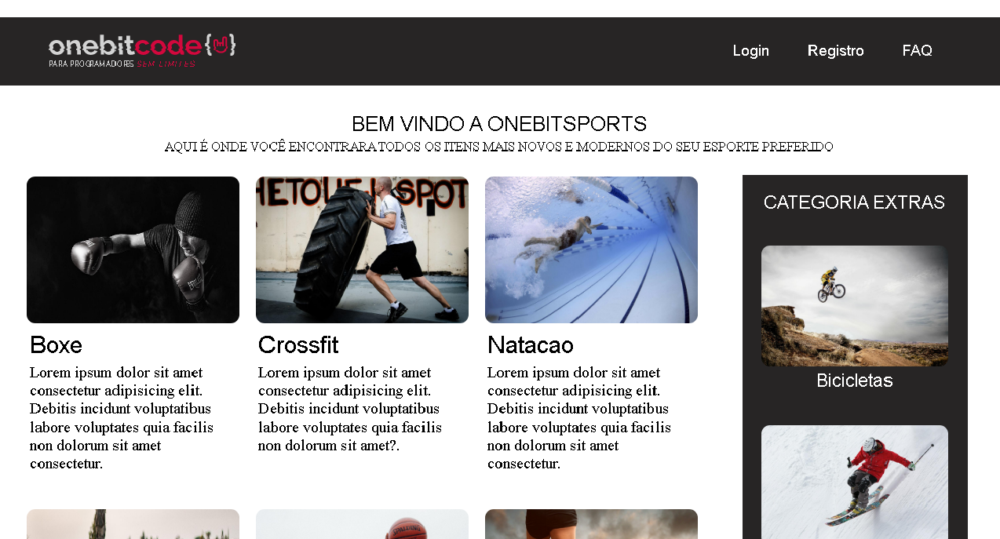
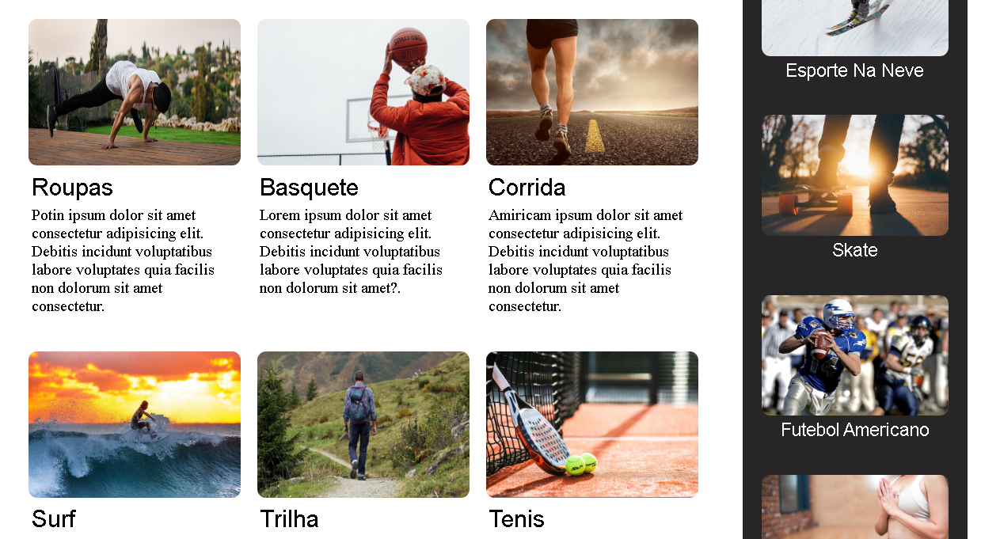

# projeto-esporte

<h3>Oi!, Tudo Bem?  
Este é um projeto academico quiado pelo professor Issac da OneBitCode, com intuito de exercitar meus conhecimento em CSS expecificamente o Flexbox e o Grid.</h3>

<ul>
  <h3>Informação</h3>
  <li>Projeto desenvolvido em HTML | CSS puro</li>
  <li>Layout Responsivo</li>
  <li>HTML5 semântico otimizado para mecanismo de busca</li>
</ul>

<ul>
  <h3>Links</h3>
  <li><a href="https://ramon-rodrigues-001.github.io/projeto-esporte/" target="_blank">Ver Site Hospedado "Deploy"</a></li>
</ul>

